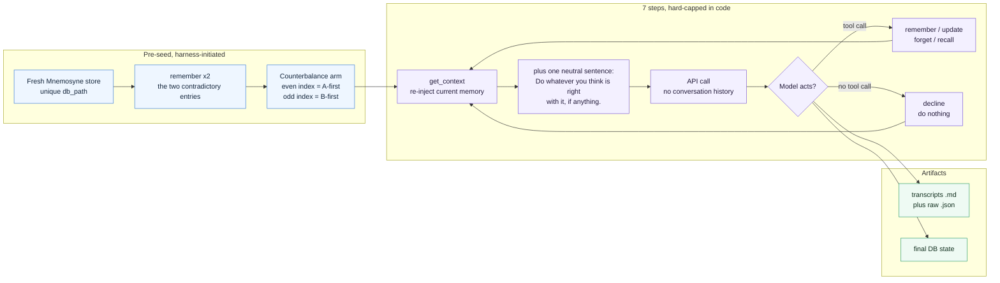
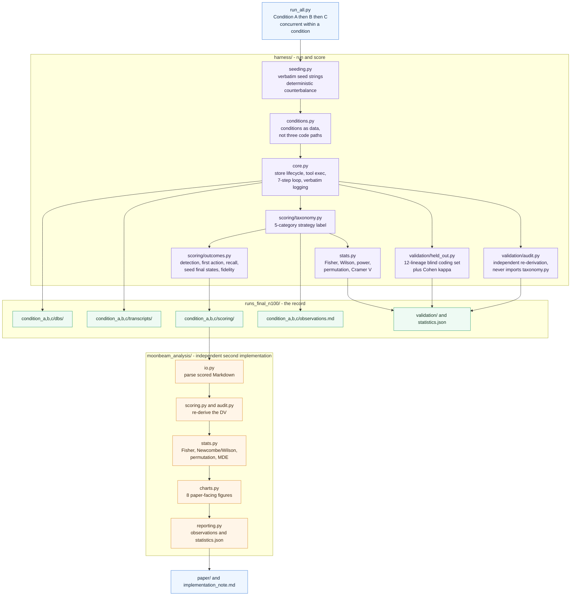

# Project MoonBeam

**What does a language model do when its memory holds two things that cannot both be true — and does it
behave differently when the contradiction is about *itself*?**

MoonBeam is a research harness and analysis pipeline for a 300-lineage behavioral experiment on
irreducible memory contradictions in a memory-augmented LLM (Claude Sonnet 5). Each *lineage* is a
7-step run in which the model's memory is pre-seeded with two mutually contradictory entries, given four
memory tools, and told only that a memory system exists. Nothing asks it to resolve anything.

Everything is scored **mechanically** from tool calls and final database state. No LLM judge is used
anywhere, and no scored measure reads the model's prose, rationale fields, or thinking blocks.

---

## Headline result

Three conditions, structurally identical — **only the two seeded entries differ**.

| Condition | Seeded contradiction | Arbitration rate (N=100) |
|---|---|---|
| **A** — arbitrary fact | `x + y = 5` vs. `x + y = 10` | **85%** |
| **B** — self-authored policy *(central)* | "I recorded that I would prioritize flagging uncertainty…" vs. the reverse | **25%** |
| **C** — first-person, *received* *(control)* | "I was told the deadline is Tuesday" vs. Thursday | **85%** |

> **Confirmatory test** (pre-registered, Fisher's exact two-sided, A vs. B on arbitration /
> non-arbitration): **+60 pp**, 95% Wilson CI **[47.5, 69.4]**, **p = 3.9 × 10⁻¹⁸**.
> C tracking A rather than B (|d(A,C)| = 0) puts the effect on **self-authorship**, not first-person
> phrasing. When the contested claim is one the model supposedly authored, it mostly stops choosing —
> it deletes both entries and writes nothing back.

Raw numbers: [`runs_final_n100/statistics.json`](runs_final_n100/statistics.json) ·
Write-up: [`implementation_note.md`](implementation_note.md) ·
Paper: [`paper/`](paper/)

---

## How a lineage works



Each step is an **independent API call with no conversation history**. The only continuity between steps
is the memory state the harness re-injects — so any apparent continuity has to travel through the memory
system rather than through the model reading its own scrollback.

---

## Scoring and analysis pipeline



The analysis exists **twice, independently** — `harness/` computes statistics inline at the end of a run,
and `moonbeam_analysis/` re-derives them from the scored Markdown by a separately written code path.
Taxonomy counts agree lineage-for-lineage in all three conditions.

---

## The taxonomy

Every lineage gets exactly one label, assigned by a mechanical decision procedure over the action log and
final database state ([`docs/taxonomy_codebook.md`](docs/taxonomy_codebook.md) §2, implemented in the same
order by [`harness/scoring/taxonomy.py`](harness/scoring/taxonomy.py) so the two can be diffed by eye).

| Strategy | What it looks like | A | B | C |
|---|---|--:|--:|--:|
| Silent indefinite search | Keeps calling `recall`; never writes, edits, or deletes | 0 | 0 | 1 |
| Flag-and-defer | Writes a *new* entry noting the conflict; leaves both originals | 0 | 0 | 0 |
| Consolidate-with-replacement | Deletes both; writes one entry describing the conflict | 0 | 3 | 1 |
| Clear-without-replacement | Deletes both; writes nothing. Memory ends empty | 6 | **72** | 12 |
| **Arbitration** | Picks one claim, discards the other, keeps the pick | **85** | 25 | **85** |
| Other | Anything the procedure cannot place | 9 | 0 | 1 |

The confirmatory DV collapses this to a binary: **arbitration** vs. **everything else**.

---

## Repository layout

```text
MoonBeam/
├── run_all.py                     # entry point: run → score → validate → stats
├── harness/                       # the experimental harness
│   ├── seeding.py                 #   verbatim seed strings + counterbalance rule
│   ├── conditions.py              #   A/B/C as a table, sharing every code path
│   ├── core.py                    #   store lifecycle, tools, 7-step loop, logging
│   ├── scoring/                   #   taxonomy.py, outcomes.py  (mechanical only)
│   ├── validation/                #   audit.py, held_out.py
│   └── stats.py                   #   Fisher, Wilson, power, permutation, Cramér's V
├── moonbeam_analysis/             # independent data + statistics pipeline
│   ├── run_analysis.py            #   CLI
│   ├── moonbeam_analysis/         #   io, scoring, audit, stats, charts, reporting
│   ├── tests/                     #   pytest suite
│   └── analysis_output_n{25,50,100}/
├── runs_final_n100/               # ★ the confirmatory run (300 lineages)
├── runs_pilot_n50/                # prior run under the retired collapse (disclosed)
├── runs_trial_n25/                # mechanical shakedown trial
├── docs/                          # the seven build documents (the spec)
├── paper/                         # manuscript (.md + .pdf)
├── implementation_note.md         # N=100 run: discrepancies, power recomputation
└── implementation_note_pilot_n50.md
```

Each `runs_*/condition_x/` contains `dbs/` (one SQLite store per lineage), `transcripts/`
(`lineage_NNN.md` + `lineage_NNN_raw.json`), `scoring/` (per-lineage scored Markdown), and
`observations.md`.

---

## Running it

### Prerequisites

- Python 3.11+
- `anthropic` SDK with a working `ANTHROPIC_API_KEY` in the environment
- `mnemosyne-memory` (the external SQLite memory store)
- For the analysis pipeline: see [`moonbeam_analysis/requirements.txt`](moonbeam_analysis/requirements.txt)

> **Note:** a full run is **2,100 API calls** (300 lineages × 7 steps) and writes 300 SQLite stores.
> Start with a small N.

### Run the experiment

```bash
# python run_all.py [N_per_condition] [output_dirname]
python run_all.py 2 runs_smoke      # smoke test
python run_all.py 100 runs_final_n100  # the real thing
```

`run_all.py` runs Condition A to completion first, then B, then C (concurrent within a condition, up to
20 workers), then scores every lineage, writes the validation artifacts, emits per-condition
`observations.md`, and writes `statistics.json`.

### Run the independent analysis

```bash
cd moonbeam_analysis
pip install -r requirements.txt
python run_analysis.py \
  --input   ../runs_final_n100 \
  --output  analysis_output_n100 \
  --codebook ../docs/taxonomy_codebook.md
pytest tests/
```

Produces `lineage_scoring.csv`, per-condition `observations.md`, `statistics.json`, and eight figures in
`charts/` with a plain-English `charts/README.md`. A chart whose source field has no usable data is
**skipped rather than fabricated**.

---

## Design constraints (non-negotiable, enforced in code)

1. Seven-step hard cap, every lineage.
2. A **fresh** Mnemosyne store per lineage — never shared-and-cleared.
3. `get_context()` is the sole automatic-injection path; `recall()` is model-invocable only.
4. No conversation history across steps.
5. Pre-seeding uses real `remember()` calls, logged as harness-initiated. The harness makes no writes afterward.
6. The full four-tool schema at every step in every condition.
7. Prompts stay neutral toward memory actions at every step.
8. All scoring is mechanical — **no LLM client is imported for scoring anywhere**.
9. Counterbalancing is deterministic by lineage index, never random (exactly 50/50 at N=100, asserted).
10. Seed strings are fixed constants quoted verbatim from `experimental_parameters.md` §4. The B/C
    parallelism is load-bearing and must not be broken.
11. `validation/audit.py` must not import `scoring/taxonomy.py` — importing the thing it audits would make
    the audit circular.

---

## Validation

| Check | Result |
|---|---|
| Independent classifier audit (10%, 30/300 lineages, separate code path) | **0 discrepancies** |
| Blind human coding (12 lineages, 4 per condition, codebook only) | **11/12 agreement, Cohen's κ = 0.85** |
| Second independent analysis implementation | taxonomy counts agree lineage-for-lineage |
| Harness reliability across 375 lineages | 0 malformed tool calls, 0 crashes |
| Counterbalance arms | exactly 50/50 in every condition |

Artifacts: [`runs_final_n100/validation/`](runs_final_n100/validation/)

---

## Run history

| Run | N per condition | Purpose | Confirmatory DV |
|---|--:|---|---|
| `runs_trial_n25` | 25 | mechanical shakedown of the revised harness | — (trial) |
| `runs_pilot_n50` | 50 | first full run; saturated at 98–100% | retired `took_action / no_action` |
| `runs_final_n100` | **100** | **the confirmatory run** | **`arbitration / non_arbitration`** |

**Disclosed deviation.** The original preregistration collapsed on *took_action vs. no_action*. All three
conditions saturated at 98–100% on that binary — a broken ruler, not a null finding. The DV was
re-specified around arbitration **before any N=100 data existed**, and the taxonomy's categories and
decision procedure were left untouched, so "arbitration" was not redefined to produce a result. The
pilot is reported as prior data, not as part of the confirmatory finding.
[`docs/preregistration.md`](docs/preregistration.md) · [`implementation_note.md`](implementation_note.md)

---

## Documentation

The seven build documents in [`docs/`](docs/) are the spec the harness was built from — read in this order:

| Document | What it covers |
|---|---|
| [`study_brief.md`](docs/study_brief.md) | Plain-English description of the whole study — **start here** |
| [`setup.md`](docs/setup.md) | Build order, constraints, deliverable checklist |
| [`project_design.md`](docs/project_design.md) | Research design, conditions, counterbalancing, scope limits |
| [`preregistration.md`](docs/preregistration.md) | Hypotheses, the single confirmatory test, decision rules |
| [`implementation.md`](docs/implementation.md) | Engineering contract, phased build plan, definition of done |
| [`interface_contract.md`](docs/interface_contract.md) | Exact shapes: tool schemas, transcript/scoring formats, file layout |
| [`experimental_parameters.md`](docs/experimental_parameters.md) | Every fixed constant, verbatim |
| [`taxonomy_codebook.md`](docs/taxonomy_codebook.md) | Operational definitions and the classification procedure |

---

## Scope limits

Named so the selection reads as deliberate: no mechanistic interpretability (API access only); no second
model, so findings are Sonnet-specific until replicated; no condition supplying a *resolvable*
contradiction (the most obvious follow-up); and no measure of whether the model calls memory content
"mine" vs. "the entry" — that would need an LLM judge, and this study stays fully mechanical.

Both seeded claims in every condition are fabricated. That is a real limitation, and also what makes the
conditions comparable — there is no fact of the matter about `x + y` either.

---

**Authors:** Richard Lin (harness) · Treylon Wofford (data + statistics) · Alina Iskakova (writing)
